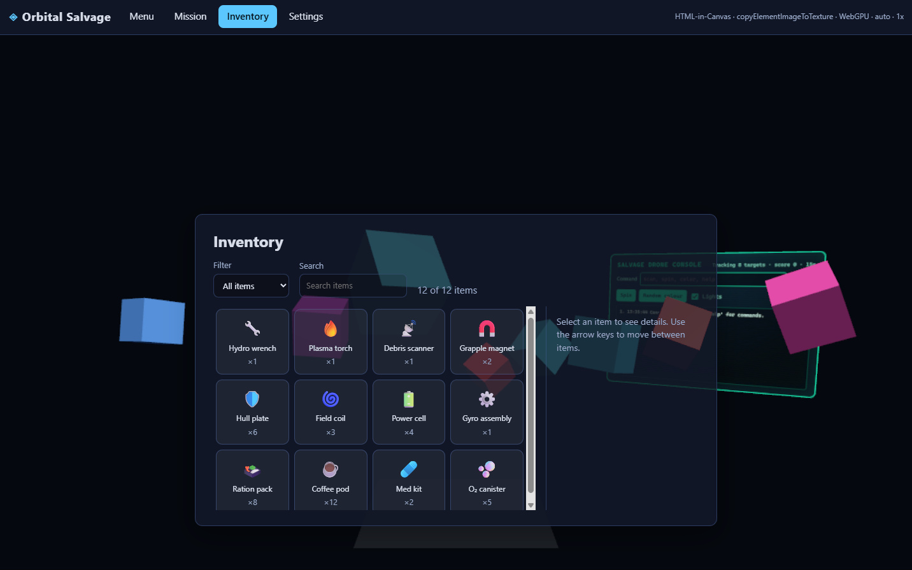

# Hiccup — HTML-in-Canvas Components Unity Package

A Unity project that develops **Hiccup** (HTML-in-Canvas Components Unity Package), a package for building Unity user interfaces out of HTML and CSS
for WebGL2 and WebGPU builds. The DOM is real and lives in the page, so it stays accessible to screen readers,
find-in-page, text selection and IME; Chrome's [HTML-in-Canvas](https://github.com/WICG/html-in-canvas) API
composites it into Unity textures, so it can be drawn as a full-screen HUD or projected onto meshes in the scene.
Browsers without the API get the same DOM as an overlay above the canvas.

In the Editor, play mode renders documents through a real Chrome driven over the DevTools Protocol, so the UI
can be seen, clicked and typed into in the Game view without making a build.

The package itself, with its own README, lives at [Packages/com.brendan.hiccup](Packages/com.brendan.hiccup).

> **[NOTE]**
> HTML-in-Canvas is an experimental browser API, currently available in Chrome 148 and newer behind the
> `chrome://flags/#canvas-draw-element` flag, or on a registered origin through the
> [Origin Trial](https://developer.chrome.com/origintrials/#/view_trial/3478467762190286849) (Chrome 148–150).
> It is expected to ship in Chrome stable in the near future. Browsers without the API fall back to the DOM
> overlay, which keeps the UI usable but cannot project it onto meshes. See the
> [WICG explainer](https://github.com/WICG/html-in-canvas) for the proposal.



## Samples

### HTML UI
Use of HTML as a UI system, including world-space UI.

https://brendan-duncan.github.io/hiccup/build/sample

### Multi-Engine
A Unity game running ThreeJS on a virtual computer, and the ThreeJS scene is running the Unity Hiccup UI Sample within it.
Is it necessary? No. Is it fun to see how far things can be pushed? Absolutely.

https://brendan-duncan.github.io/hiccup/build/multiengine

## Repository layout

| Path | What it is |
| --- | --- |
| [Packages/com.brendan.hiccup/](Packages/com.brendan.hiccup/) | The package, embedded. Runtime bridge, Editor preview, docs. |
| [Packages/com.brendan.hiccup/Documentation~/](Packages/com.brendan.hiccup/Documentation~/) | User guide, runtime internals, Editor preview internals. |
| [Assets/Samples/Hiccup/0.1.0/Full UI Sample/](Assets/Samples/Hiccup/0.1.0/Full%20UI%20Sample/) | The main sample, "Orbital Salvage": menu, settings, HUD, inventory, dialogs, a world-space console. |
| [Assets/Samples/Hiccup/0.1.0/Three.js Desk/](Assets/Samples/Hiccup/0.1.0/Three.js%20Desk/) | A three.js page on a monitor: a same-origin iframe painted by HTML-in-Canvas onto a world-space quad, driven by a mouse you drag around the desk. |
| [Assets/Samples/Hiccup/0.1.0/uGUI Mirror/](Assets/Samples/Hiccup/0.1.0/uGUI%20Mirror/) | Experimental: an ordinary uGUI form built in code and mirrored into a document by `HtmlUguiMirror`, so it is drawn and clicked as DOM. |
| [Assets/WebGLTemplates/Hiccup/](Assets/WebGLTemplates/Hiccup/) | WebGL template with a full-window canvas and the Origin Trial `<meta>` placeholder. |

## Getting started

**Requirements**

* Unity 6000.0 or newer with the Web platform module. This project is currently on 6000.6.
* Google Chrome, for the Editor preview. It is found in the usual install locations, or through the
  `HICCUP_CHROME` environment variable.
* For a web build: Chrome 148 or newer with `chrome://flags/#canvas-draw-element` enabled, or an
  [Origin Trial token](https://developer.chrome.com/origintrials/#/view_trial/3478467762190286849) for your
  origin. Other browsers fall back to the overlay.

**Run the sample in the Editor**

1. Open the project and load `HiccupSample` from `Assets/Samples/Hiccup/0.1.0/Full UI Sample/Scenes`.
   The scene holds only a bootstrap component; it builds the camera, the props and both HTML surfaces at runtime.
2. Press Play. The Editor preview starts Chrome in the background and the UI appears in the Game view within a
   second or two. Buttons, form controls and text fields work.
3. Toggles for the preview are under **Window ▸ Hiccup**: turn it off, run Chrome visibly instead of headless,
   forward the page's console, or flip the frame if your graphics API draws it upside down.

**Build for the web**

1. Set **Project Settings ▸ Player ▸ Resolution and Presentation ▸ WebGL Template** to `Hiccup`.
2. Switch to the Web platform, pick WebGL2 or WebGPU, and build.
3. Serve the build and open it in Chrome with the flag or token above. The console reports which mode the
   bridge chose and which HTML-in-Canvas entry points it found.

## Using the package elsewhere

Copy `Packages/com.brendan.hiccup` into another project's `Packages` folder, or reference it from
`Packages/manifest.json`:

```json
"com.brendan.hiccup": "file:../../hiccup/Packages/com.brendan.hiccup"
```

The samples live in this project rather than in the package, so copy `Assets/Samples/Hiccup` across as well if
you want them there. They show what the package expects of your HTML, CSS and C#. The [user guide](Packages/com.brendan.hiccup/Documentation~/UserGuide.md) is the place to start authoring.

## Documentation

| Document | Covers |
| --- | --- |
| [Package README](Packages/com.brendan.hiccup/README.md) | Overview, quick start, component and API summary, limitations. |
| [UserGuide.md](Packages/com.brendan.hiccup/Documentation~/UserGuide.md) | Authoring UI: setup, HTML and CSS conventions, events, updates, world panels, input, accessibility, troubleshooting. |
| [Runtime.md](Packages/com.brendan.hiccup/Documentation~/Runtime.md) | The web build: the bridge, paint model, texture transport on WebGL2 and WebGPU, geometry and hit testing. |
| [EditorPreview.md](Packages/com.brendan.hiccup/Documentation~/EditorPreview.md) | The Editor: Chrome over DevTools, the frame pipeline, pointer and keyboard relay, the element handle model. |
| [UguiMirror.md](Packages/com.brendan.hiccup/Documentation~/UguiMirror.md) | Experimental: mirroring a uGUI canvas into a document, the component-by-component mapping, and its limits. |
| [CHANGELOG.md](Packages/com.brendan.hiccup/CHANGELOG.md) | What changed, and what is unreleased. |

## Status

Experimental. HTML-in-Canvas is in Origin Trial in Chrome 148–150 and its function signatures may still change;
the bridge feature-detects each variant it knows about. The package is at 0.1.0 with an unreleased Editor
preview; see the changelog for what is in flight.

## License

MIT. See [LICENSE.md](Packages/com.brendan.hiccup/LICENSE.md) in the package.
